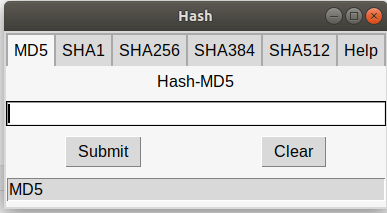

# Hash

Hash (MD5, SHA1, SHA384, SHA512, SHA256) GUI  


## How to Install:
Run the following command:  
```bash
python -m venv venv
source venv/bin/activate
pip install -r requirements.txt
```

## How to Run:

Execute the script with:

```bash 
python main.py
```